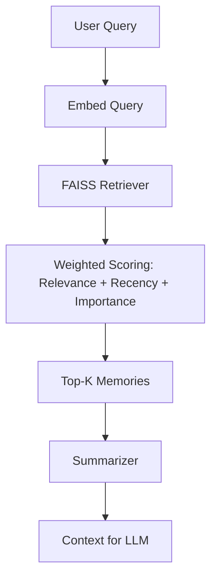

# 🧠 Human-Like Memory System for Conversational AI

This project implements a **human-inspired memory architecture** for AI agents, combining:

- 🧠 **Episodic Memory** — raw chronological experiences  
- 🧠 **Semantic Memory** — abstracted long-term knowledge  
- 🔍 **FAISS Vector Search** — scalable similarity retrieval  
- ⚖️ **Weighted Recall** — relevance + recency + importance  
- 📝 **Summarization Pipeline** — consolidates long-term memory  
- 🚀 **FastAPI Server** — memory as an API for LLM agents  

This system enables AI agents to **remember like humans**, supporting long-term personality, contextual understanding, and emotional continuity.

---

## 🧠 1. Why This Memory System?

LLMs are stateless — without memory, they forget everything.

This causes:

- ❌ No long-term personalization  
- ❌ Repetition or contradictions  
- ❌ High token costs  
- ❌ No evolving memory  

This project solves these issues using a **dual-memory cognitive architecture**.

---

## 🧩 2. Architecture Overview



---

## ⚙️ 3. Key Features

### 🔹 Dual Memory System

| Memory Type       | Purpose                                                 |
|------------------|----------------------------------------------------------|
| **Episodic Memory**  | Stores raw, time-ordered interactions                    |
| **Semantic Memory**  | Stores condensed summaries & stable long-term knowledge  |

---

### 🔹 FAISS-Based Vector Retrieval

- Fast similarity search  
- Scales to 100K+ memories  
- CPU-friendly retrieval  

---

### 🔹 Weighted Recall Formula

```text
score = α * relevance
      + β * recency
      + γ * importance
```

This produces **human-like recall behavior**.

---

### 🔹 Summarization Layer

- Compresses memory  
- Removes noise  
- Supports long-term continuity  

---

### 🔹 FastAPI Backend

Two main endpoints:

```
POST /remember
POST /recall
```

---

## 🏗 4. Project Structure

```
src/
│── api.py               # FastAPI memory API
│── config.py            # Hyperparameters + scoring
│── embeddings.py        # Embedding model loader
│── memory_store.py      # Dual-memory architecture
│── summarizer.py        # Summarization logic
│── __init__.py
```

---

## 🧪 5. API Usage

### ➤ Store a memory

```json
POST /remember
{
  "text": "User said they love AI research.",
  "importance": 0.8,
  "memory_type": "episodic"
}
```

---

### ➤ Recall memories

```json
POST /recall
{
  "query": "What does the user like?",
  "k": 5
}
```

---

### Example Response

```json
{
  "memories": [
    {
      "id": "episodic-0",
      "text": "User said they love AI research.",
      "score": 0.94
    }
  ],
  "summary": "The user loves AI research."
}
```

---

## 🚀 6. Run Locally

### Install dependencies

```bash
pip install -r requirements.txt
```

### Start server

```bash
uvicorn src.api:app --reload
```

Open Swagger docs:  
👉 http://127.0.0.1:8000/docs

---

## 📈 7. Performance & Scalability

- ⚡ Sub-millisecond retrieval  
- ⚡ Embedding caching  
- ⚡ Supports 100K+ memories  
- ⚡ Time-decay recency scoring  

Ideal for:

- LLM agents  
- RAG memory systems  
- Personalized assistants  
- Character AI  

---

## 🔮 8. Future Enhancements

- Forgetting mechanisms  
- Emotional weighting  
- Semantic consolidation with LLM  
- Multi-user memory isolation  
- Dashboard for visualizing memory graphs  

---

## 👩‍💻 Author

**Sanjivani Chavan**  
AI Engineer | LLM Systems | Memory Architectures | RAG Engineering

